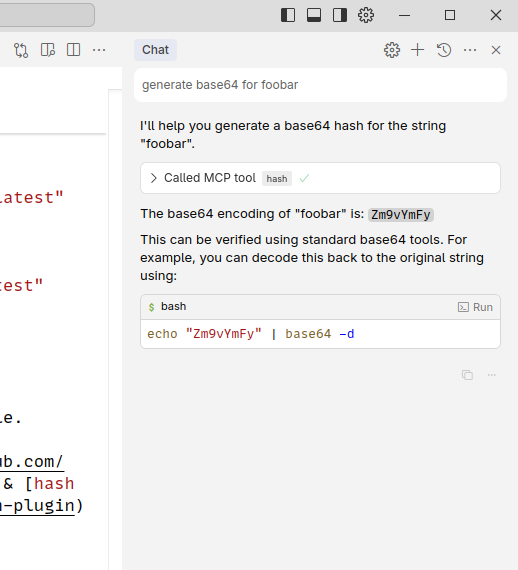

# hyper-mcp

> Build, publish & run your Model Context Protocol (MCP) applet with ease.

<p align="center">
  
</p>

## Overview

`hyper-mcp` is a powerful MCP server that leverages WebAssembly plugins to extend its capabilities. At its core, it's a single, extensible MCP server that you can enhance with plugins written in any WebAssembly-compatible programming language. Think of it as a modular toolkit where each plugin adds new functionality without the overhead of running multiple MCP servers.

Whether you're using Claude Desktop, Cursor IDE, or any other MCP-compatible application, `hyper-mcp` seamlessly integrates with your workflow while using standard OCI registries for plugin distribution.

## Why hyper-mcp?

### WebAssembly-First

- Easy local runtime embedding
- First-class support in many programming languages
- Leverages Extism's PDKs for simplified plugin development

### OCI Registry Integration

- Uses existing container infrastructure
- Familiar packaging workflow with Dockerfiles
- Enables self-hosting for enterprise environments

## Key Features

- **Language Agnostic**: Build plugins in any language that compiles to WebAssembly
- **Simple Distribution**: Package plugins using Dockerfile and publish to any OCI registry
- **Universal Compatibility**: Works with any MCP-compatible application
- **Easy Configuration**: Add new tools by simply editing a config file and restarting the MCP server

## Quick Start

1. Create a configuration file at `$HOME/.config/hyper-mcp/config.json`:

```json
{
  "plugins": [
    {
      "name": "time",
      "path": "oci://ghcr.io/tuananh/time-plugin:latest"
    },
    {
      "name": "qr-code",
      "path": "oci://ghcr.io/tuananh/qrcode-plugin:latest"
    },
    {
      "name": "hash",
      "path": "oci://ghcr.io/tuananh/hash-plugin:latest"
    },
    {
      "name": "myip",
      "path": "oci://ghcr.io/tuananh/myip-plugin:latest",
      "runtime_config": {
        "allowed_host": "1.1.1.1"
      }
    },
    {
      "name": "fetch",
      "path": "oci://ghcr.io/tuananh/fetch-plugin:latest",
      "runtime_config": {
        "allowed_host": "*"
      }
    }
  ]
}
```

The `path` can be:
- A local file path
- An HTTP URL
- An OCI image reference

2. Start the server:

```sh
$ hyper-mcp
```

## Integration Guides

### Cursor IDE Integration

1. Configure Cursor to use hyper-mcp:


2. Access tools through Cursor's chat UI:



### Claude Desktop Integration

Documentation coming soon for Windows/macOS users.

## Building Plugins

hyper-mcp uses [Extism](https://github.com/extism/extism) for plugin development. Check out our example plugins:

- [Time plugin](https://github.com/tuananh/hyper-mcp/tree/main/examples/plugins/time): Simplest plugin that allow you to ask LLM what time is it now.
- [QR Code plugin](https://github.com/tuananh/hyper-mcp/tree/main/examples/plugins/qr-code): Generate QR image.
- [Hash plugin](https://github.com/tuananh/hyper-mcp/tree/main/examples/plugins/hash): Generate all kind of hashes for you.
- [My IP plugin](https://github.com/tuananh/hyper-mcp/tree/main/examples/plugins/myip): An example how to do HTTP request with `hyper-mcp`.
- [Fetch plugin](https://github.com/tuananh/hyper-mcp/tree/main/examples/plugins/fetch): An example how to fetch basic webpages. No full browser capability yet.
- [Crypto price plugin](https://github.com/tuananh/hyper-mcp/tree/main/examples/plugins/crypto-price): An example of writing a plugin in Go.
- [Filesystem plugin](https://github.com/tuananh/hyper-mcp/tree/main/examples/plugins/fs): An example plugin that allow you to securely access file system.

### Publishing Plugins

Publishing a plugin to an OCI registry is straightforward:

1. Build your WebAssembly plugin
2. Create a Dockerfile:

```dockerfile
FROM scratch
WORKDIR /
COPY --from=builder /workspace/target/wasm32-wasip1/release/your-plugin.wasm /plugin.wasm
```

3. Build and push:
```sh
docker build -t your-registry/plugin-name .
docker push your-registry/plugin-name
```

## License

[Apache 2.0](./LICENSE)
