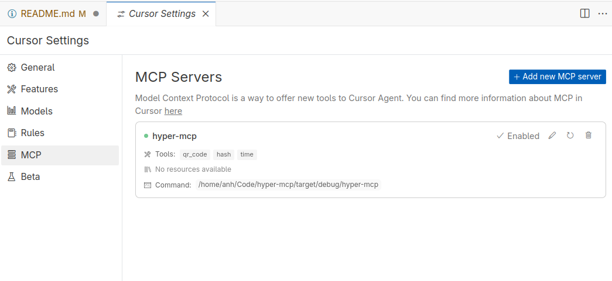

# hyper-mcp

> Build, publish & run your Model Context Protocol (MCP) applet with ease.

<p align="center">
  
</p>

## Features

- Build `hyper-mcp` plugins in any language you want, as long as they can compile to WebAssembly.
- Package using Dockerfile & publish `hyper-mcp` plugins to any OCI registry.
- Use it with any MCP-compatible application, e.g., Claude Desktop, Cursor IDE.

## Design Decisions

I admire Extism and Dylibso but have differing opinions on a few aspects:

- I prefer not to use a custom registry (like XTP) when we already have the OCI registry.
- Requiring an account with `mcp.run` to obtain an `MCP_SESSION_ID` just to run an MCP isn't user-friendly.

### Why WebAssembly?

- WebAssembly runtimes are easy to embed locally.
- WebAssembly is becoming first-class in many languages, allowing development in any language that supports a Wasm target.
- Projects like [Extism](https://github.com/extism/extism) simplify packaging code into plugins with their PDKs. They support a variety of languages, including Rust, JS, Go, .NET, C, and Zig.

### Why OCI Registry?

- Avoid building yet another registry while leveraging existing infrastructure.
- Utilize existing tooling for packaging. Users can simply use a `Dockerfile` to package `hyper-mcp` plugins.
- Self-hosting is possible, eliminating the need to whitelist additional endpoints for corporate users.

## Usage

1. Create an example configuration file at `$HOME/.config/mcp.json`:

  ```json
  {
    "plugins": [
      {
        "name": "time",
        "path": "/home/anh/Code/hyper-mcp/wasm/time.wasm"
      },
      {
        "name": "qr-code",
        "path": "oci://ghcr.io/tuananh/qrcode-plugin:latest"
      },
      {
        "name": "hash",
        "path": "oci://ghcr.io/tuananh/hash-plugin:latest"
      }
    ]
  }
  ```

`path` can be an HTTP URL, an OCI image or a local file.

2. Run it

```sh
$ hyper-mcp
```

## Configure Claude Desktop to use hyper-mcp

To be updated

## Configure Cursor to use hyper-mcp



## How to build plugin

Plugins are taken directly from mcp.run examples as I use Dylibso's Extism project. There is just a tiny bit different on how I decide on packaging & publishing as we use OCI registry here.

See [examples/plugins](./examples/plugins) for some of the example plugins in Rust.

## Publish hyper-mcp plugin to OCI registry

This is just easy as

```sh
docker build ...
docker push
```

We expect there will be a `plugin.wasm` file at root `/`. So once you built the artifact, just use `scratch` image and copy the artifact over to `/`

```dockerfile
# build wasm ....

FROM scratch
WORKDIR /
COPY --from=builder /workspace/target/wasm32-wasip1/release/qrcode.wasm /plugin.wasm
```

## License

[Apache 2.0](./LICENSE)
